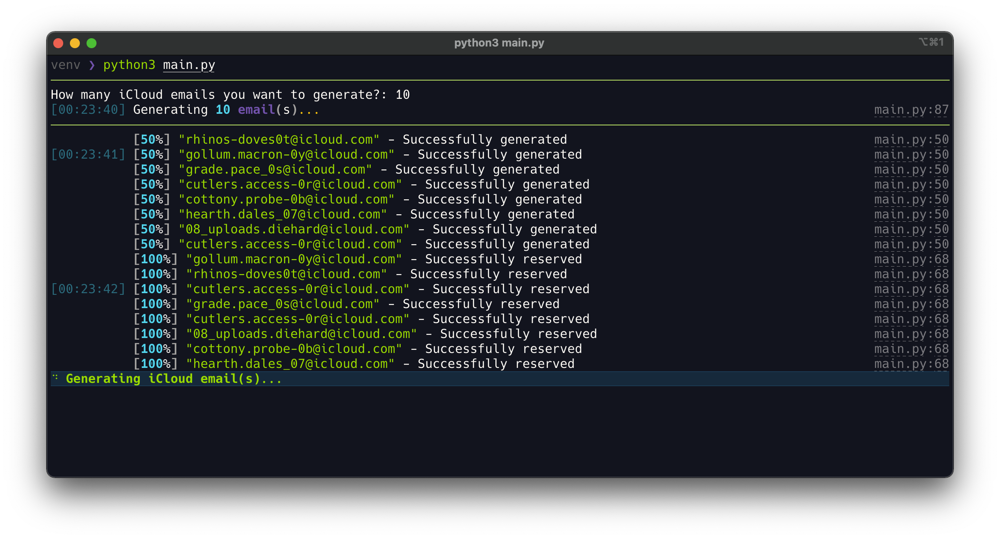
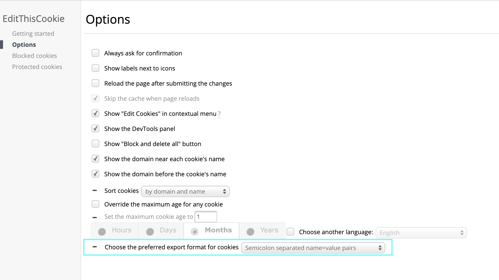
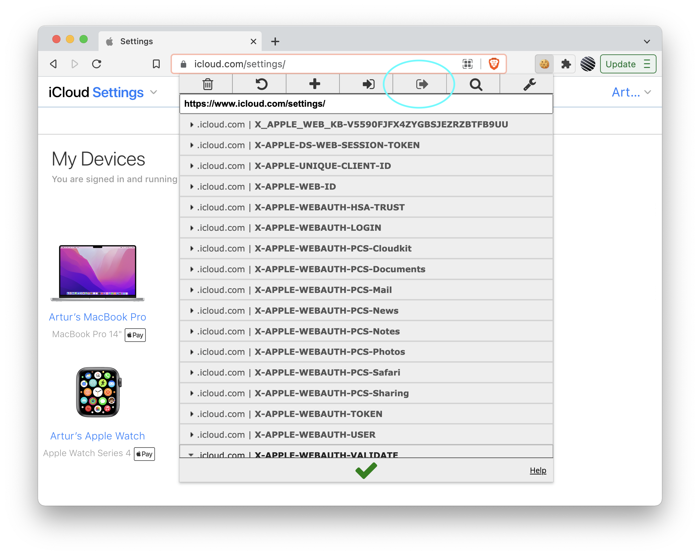

<p align="center"></p>

> Automated generation of Apple's iCloud emails via HideMyEmail.

_You do need to have an active iCloud+ subscription to be able to generate iCloud emails..._

<p align="center"></p>

## Usage

You can get prebuild binaries for Windows & ARM Macs from the [releases page](https://github.com/rtunazzz/hidemyemail-generator/releases). Follow the guide steps 1 & 2 below if you'd like to run it from source, otherwise you can skip to the 3rd step - set your cookie and run.

Apple allows you to create 5 * # of people in your iCloud familly emails every 30 mins or so. From my experience, they cap the amount of iCloud emails you can generate at ~700.

## Setup
> Python 3.12+ is required!

1. Clone this repository

```bash
git clone https://github.com/rtunazzz/hidemyemail-generator
```

2. Install requirements

```bash
pip install -r requirements.txt
```

3. [Save your cookie string](https://github.com/rtunazzz/hidemyemail-generator#getting-icloud-cookie-string)

   > You only need to do this once 🙂

4. You can now run the gen with:


**on Mac:**

```bash
python3 main.py
```

**on Windows:**

```bash
python main.py
```

This interactive mode now asks for both the number of emails and the generation mode.

If you prefer the CLI directly:

```bash
python3 cli.py generate --count 25 --mode old-account
python3 cli.py generate --count 5 --mode fresh-account
```

- `old-account`: current bulk mode. Generates emails as fast as possible and does not try to stay under Apple's rate limit.
- `fresh-account`: slower mode for newer accounts. It makes one generation attempt in each 12-minute window, at a random time between minute 5 and 12, which keeps it around 5 attempts per hour.

## Multiple accounts

You can also manage multiple iCloud accounts in parallel with a JSON config file.

Create an `accounts.json` file from [`accounts.example.json`](./accounts.example.json):

```json
[
  {
    "name": "fresh-main",
    "cookie_file": "cookies/fresh-main.txt",
    "mode": "fresh-account",
    "count": 5
  },
  {
    "name": "old-bulk",
    "cookie_file": "cookies/old-bulk.txt",
    "mode": "old-account",
    "count": 25
  }
]
```

Notes:

- `cookie_file` is required.
- `mode` is optional. If it is omitted for an account, the CLI `--mode` value is used. That global value defaults to `old-account`.
- `count` is optional. If it is omitted for an account, the CLI `--count` value is used instead.
- Relative `cookie_file` paths are resolved from the folder that contains `accounts.json`.

Generate with multiple accounts:

```bash
python3 cli.py generate --accounts-file accounts.json --count 5
```

Each account runs with its own cookie file and its own mode. If an account has its own `count`, that value overrides the CLI `--count`.

List emails across multiple accounts:

```bash
python3 cli.py list --accounts-file accounts.json
python3 cli.py list --accounts-file accounts.json --export all_accounts.csv
```

## Getting iCloud cookie string

> There is more than one way how you can get the required cookie string but this one is _imo_ the simplest...

1. Download [EditThisCookie](https://chrome.google.com/webstore/detail/editthiscookie/fngmhnnpilhplaeedifhccceomclgfbg) Chrome extension

2. Go to [EditThisCookie settings page](chrome-extension://fngmhnnpilhplaeedifhccceomclgfbg/options_pages/user_preferences.html) and set the preferred export format to `Semicolon separated name=value pairs`

<p align="center"></p>

3. Navigate to [iCloud settings](https://www.icloud.com/settings/) in your browser and log in

4. Click on the EditThisCookie extension and export cookies

<p align="center"></p>

5. Paste the exported cookies into a file named `cookie.txt`

# License

Licensed under the MIT License - see the [LICENSE file](./LICENSE) for more details.

Made by **[rtuna](https://twitter.com/rtunazzz)**.
